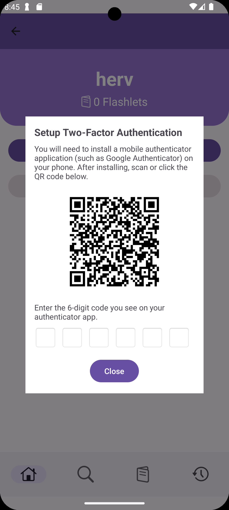
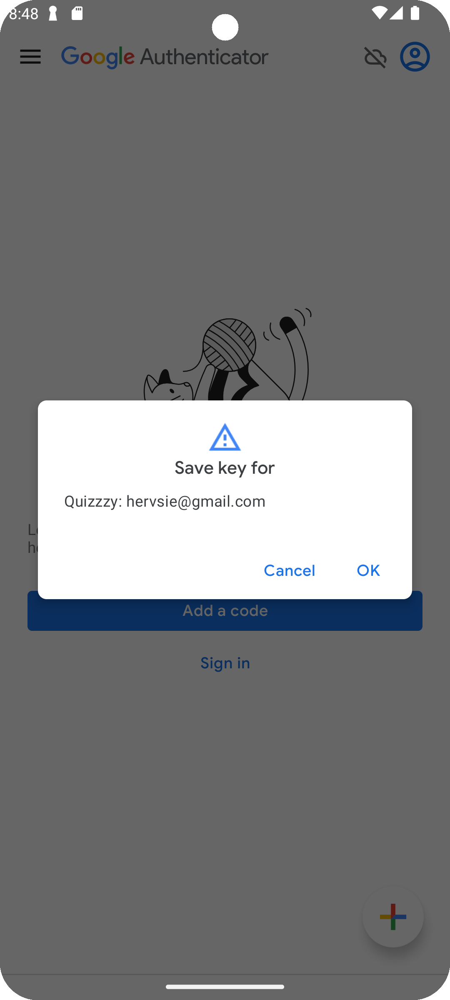
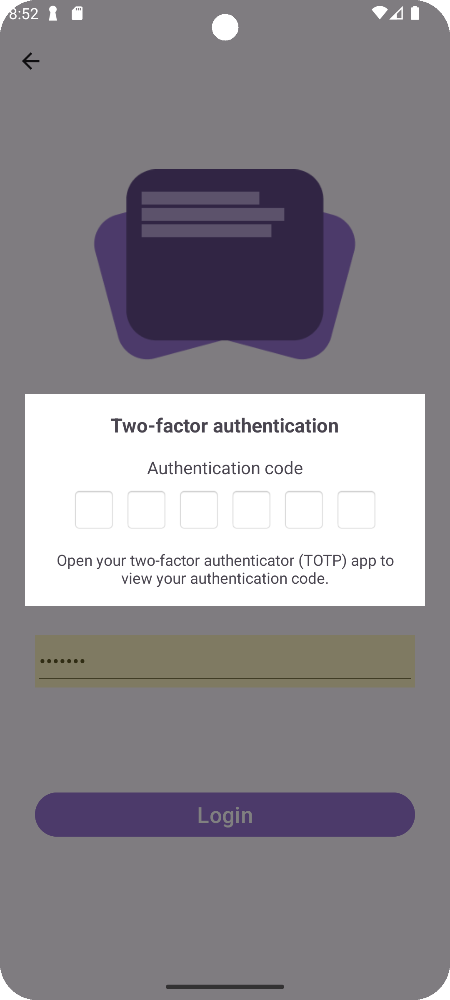

# 2 Factor Authentication
For [Hervin's](https://github.com/kurvyherv) Stage 2 feature, I developed a feature allowing users to enable 2 Factor Authentication for their account. This feature enhances the security of the user's account, ensuring that only the user can access their account.

### Breakdown of Features Developed
These are a list of features developed under my Stage 2 Submission. A full description of each feature will be listed further below.
1. Generate secret key
2. Generate Timed One-Time Password (TOTP)
3. Register User for 2FA
4. Authenticate User with 2FA

## Generate secret key
When a user enables 2FA, a secret key is generated for the user. This secret key is used to generate the Time-based One-Time Password (TOTP) for the user. The secret key is stored in firestore.

To generate the secret key, the SecureRandom class was used to generate a random byte array. This byte array is then encoded to Base32 to generate the secret key.

```java
SecureRandom random = new SecureRandom();
byte[] bytes = new byte[SECRET_SIZE];
random.nextBytes(bytes);

// Encode in Base32
StringBuilder base32 = new StringBuilder();
for (byte b : bytes) {
    base32.append(BASE32_CHARS.charAt((b & 0xFF) % BASE32_CHARS.length()));
}
return base32.toString();
```


## Generate Timed One-Time Password (TOTP)
The Time-based One-Time Password (TOTP) is generated using the secret key and the current time. The TOTP is generated using the HMAC-SHA1 algorithm.

The following code snippet takes a base32 class and decodes it into a byte array.
```java
Base32 base32 = new Base32();
byte[] key = base32.decode(secretKey);
```

The following code snippet converts the current time in seconds divided by 30 seconds into a byte array.
```java
byte[] data = new byte[8];
for (int i = 7; i >= 0; i--) {
data[i] = (byte) (counter & 0xFF);
counter >>= 8;
}
```

The following code snippet generates the HMAC-SHA1 hash of the secret key by combining the secret key and the time byte array.
```java
SecretKeySpec signKey = new SecretKeySpec(key, HMAC_ALGO);
Mac mac = Mac.getInstance(HMAC_ALGO);
mac.init(signKey);
byte[] hash = mac.doFinal(data);
```

The following code snippet is used to get the offset of the last byte.
```java
int offset = hash[hash.length - 1] & 0xF;
```

After getting the offset, the following code snippet is used to get the 4 bytes of the hash.
```java
int truncatedHash = hash[offset] & 0x7F;
for (int i = 1; i < 4; i++) {
    truncatedHash <<= 8;
    truncatedHash |= hash[offset + i] & 0xFF;
}
```

To get the TOTP, the following code snippet is used to get the last 6 digits of the truncated hash.
```java
truncatedHash %= Math.pow(10, TOTP_DIGITS);
```

## Register User for 2FA
When a user enables 2FA, the user will be prompted with a QR code. The QR code contains the secret key and the user's email. The user can scan the QR code using an authenticator app to register the user for 2FA.

The user can also press the QR code and they will be sent to google authenticator if installed or to the app store to download the app. After being sent to google authenticator, the app automatically registers the user for 2FA. Removing the need for the user to use a second device to scan the QR code.

<div style="display: flex; gap: 10px;">
   
   
</div>

## Authenticate User with 2FA
When a user logs in, the user will be prompted to enter the 6 digit code generated by the authenticator app.

<div style="display: flex; gap: 10px;">
   
</div>