# Flashlet Sharing / Collaboration & Downloading
For [Charlotte's](https://github.com/mellamadrama) Stage 2 feature, I developed two feature, the first allowing users to share their flashlets with other user through a generated QR code. Second is allowing users to download their flashlet(s) into pdf files on their devices.

### Breakdown of Features Developed
These are a list of features developed under my Stage 2 Submission. A full description of each feature will be listed further below.
1. QR Code Generator for Flashlets (Flashlet Collaboration)
2. In-built QR Code Scanner for Flashlets (Flashlet Collaboration)
3. Supporting External QR Code Scanner (Flashlet Collaboration)
4. Downloading Flashlet in PDF Format

## QR Code Generator for Flashlets (Flashlet Collaboration)
This feature allows users to share their Flashlets with others through a generated QR code. Users can scan the QR code using either an external scanner or the built-in scanner within the app. When someone scans the QR code, they are added as a collaborator on the Flashlet. Collaborators have the ability to edit the Flashlet, add more Flashcards, and share the Flashlet further. However, only the original creator can delete the Flashlet.

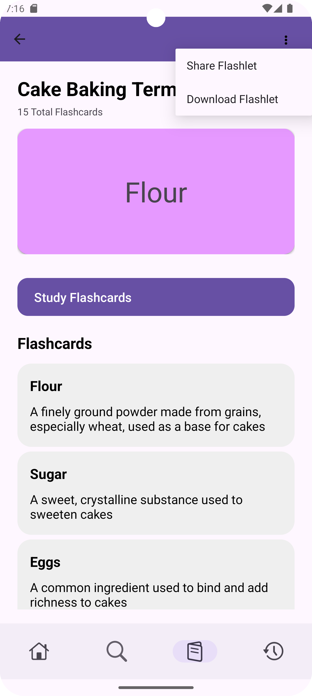
At the top of the Flashlet, I have added a kebab menu with two options: "Share Flashlet" and "Download Flashlet." When users select "Share Flashlet" a Dialog box will appear.

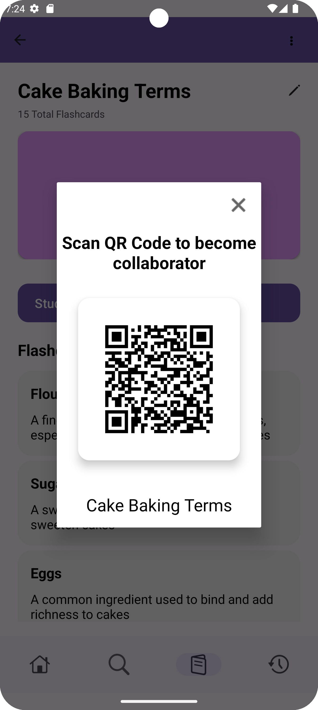
The Dialog box appears in the center above the Flashlet, with a tinted background. In the top corner of the dialog box, there is an "X" button to close it. The message "Scan QR Code to become collaborator" is displayed at the top. In the middle, there is the generated QR code, which contains the flashletId of the Flashlet the user is viewing. At the bottom, the name of the Flashlet is displayed to let users know which Flashlet they are sharing.

Once a user displays the QR code for the Flashlet, another user can scan the QR code using either the in-built scanner within the app or their phone's scanner.

## In-built QR Code Scanner for Flashlets (Flashlet Collaboration)
This feature allows users to scan a QR code using an in-built scanner, enabling them to join the Flashlet directly.

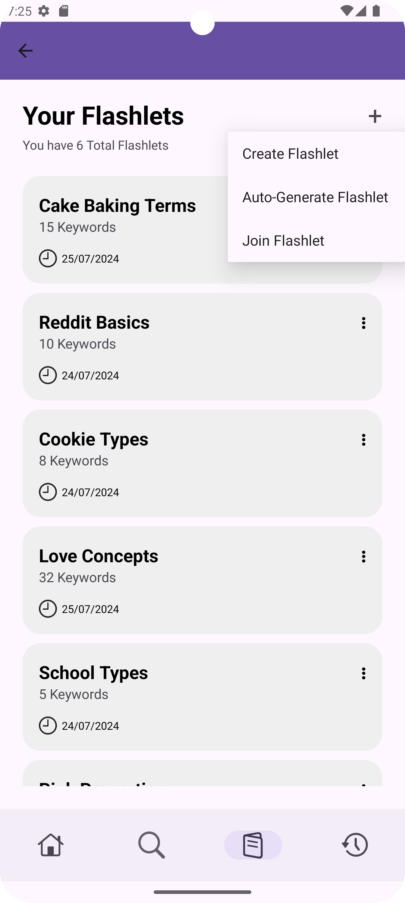
If the user wants to use the in-built scanner, they need to navigate to the Flashlet list page. From there, they can click on the "+" button next to "Your Flashlets" and select the "Join Flashlet" option.
 

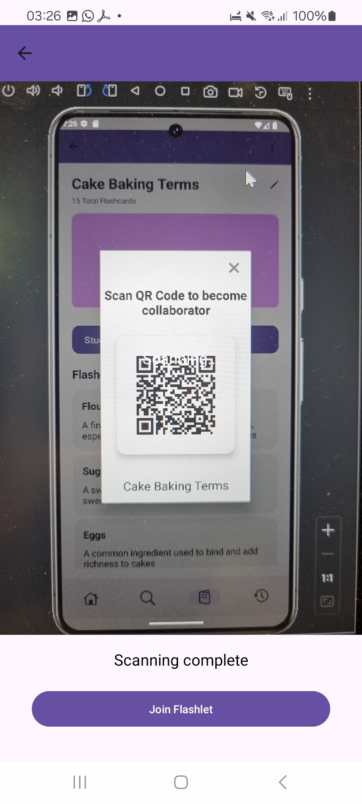
If the user decides to use the in-built scanner, they will be taken to the screen featuring the in-built scanner. The scanner screen has a navigation bar at the top with a back button. The middle of the screen is the camera area where they can scan the QR code, with the word "Scanning..." displayed in the center. At the bottom, there is a "Join Flashlet" button. Once the scanning is complete, the message "Scanning Complete" will be shown.
 

  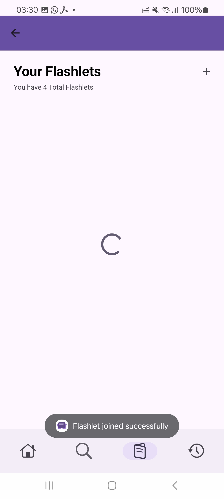
  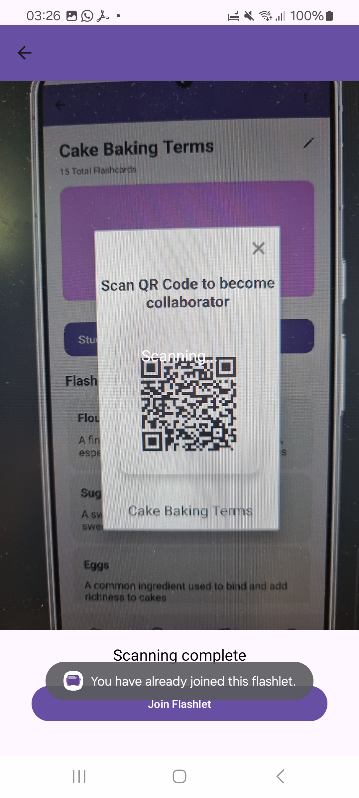

For the in-built scanner, when the user clicks on the "Join Flashlet" button, they will be handled as follows:

If the user does not already have the Flashlet, they will be redirected to the Flashlet list screen, and a toast message will appear at the bottom of the screen, indicating that the Flashlet has been added successfully.

If the user already has the Flashlet, a toast message will appear on the bottom of the screen informing them that they have already joined the Flashlet.

## Supporting External QR Code Scanner (Flashlet Collaboration)
This feature allows users to scan a QR code using their phones Qr Code scanner, enabling them to join the Flashlet directly.

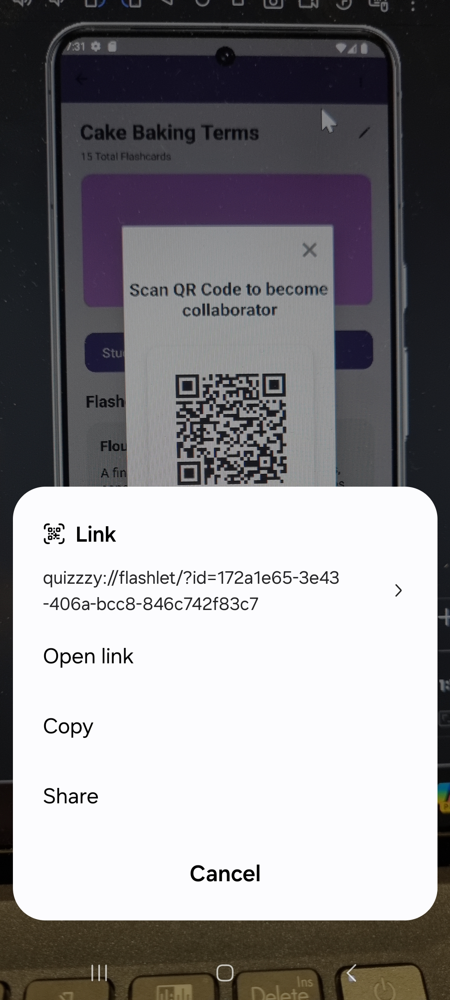
If the user chooses to scan the QR code with an external scanner, the interface will vary depending on the phone. Once the Flashlet QR code is scanned, a pop-up will appear at the bottom of the screen. This pop-up will display the link to the Flashlet, including the app name, Flashlet, and flashletId.
 

  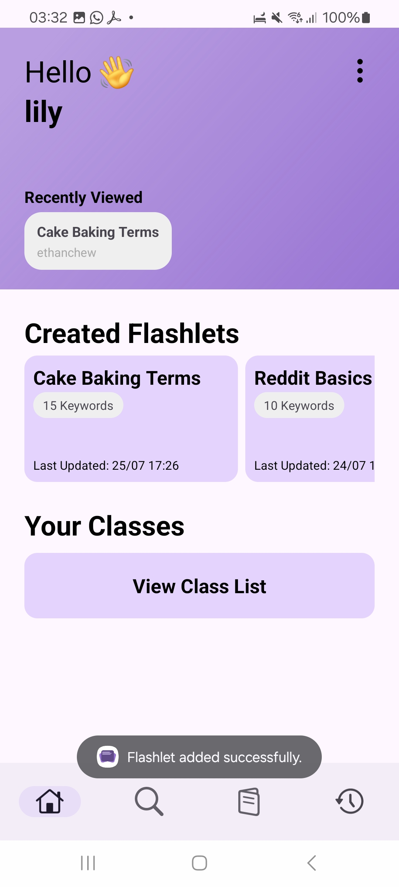
  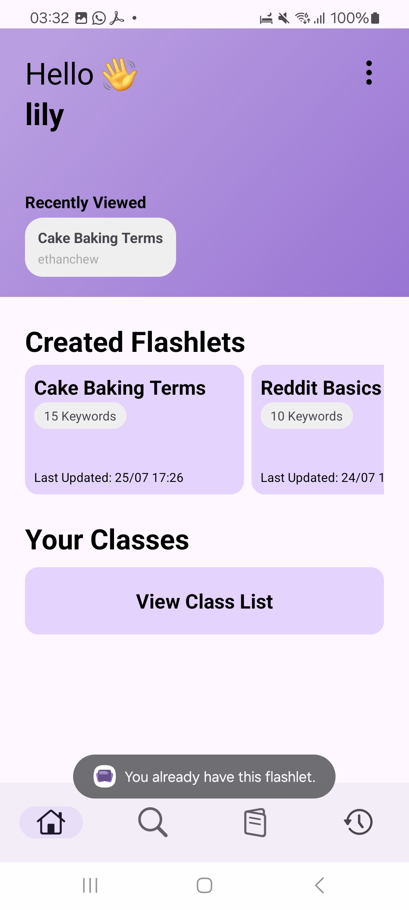

For the external scanner, when the user clicks on the Link, they will be handled as follows:

If the user des not already have the Flashlet, they will be redirected to the Home screen, and a toast message will appear at the bottom of the screen, indicating that the Flashlet has been added successfully.

If the user already has the Flashlet, they will be redirected to the Home screen, and a toast message will appear at the bottom of the screen, informing them that they have already have the Flashlet.

## Downloading Flashlet in PDF Format
This feature allows users to download any Flashlet they choose in PDF format.

At the top of the Flashlet, I have added a kebab menu with two options: "Share Flashlet" and "Download Flashlet." When users select "Download Flashlet" an Alert Dialog box will appear.
 

An Alert Dialog appears in the center above the Flashlet, with a tinted background, asking the user if they want to download a PDF version of the Flashet, with a "No" or "Yes" buttons.
 

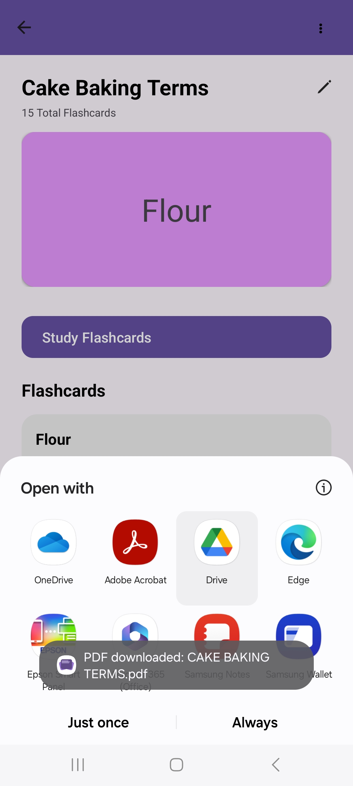
Once the user clicks on the "Yes" option, a pop-up will appear at the bottom of the screen displaying various app options for opening the downloaded PDF of the Flashlet. Additionally, a toast message will inform the user that the Flashlet has been successfully downloaded.
 

  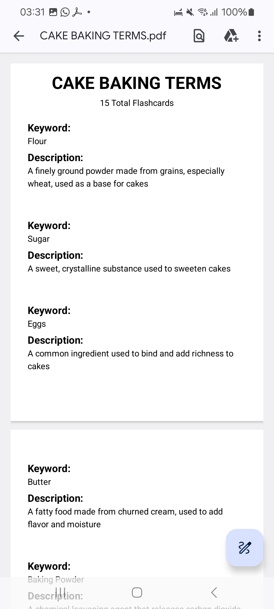
  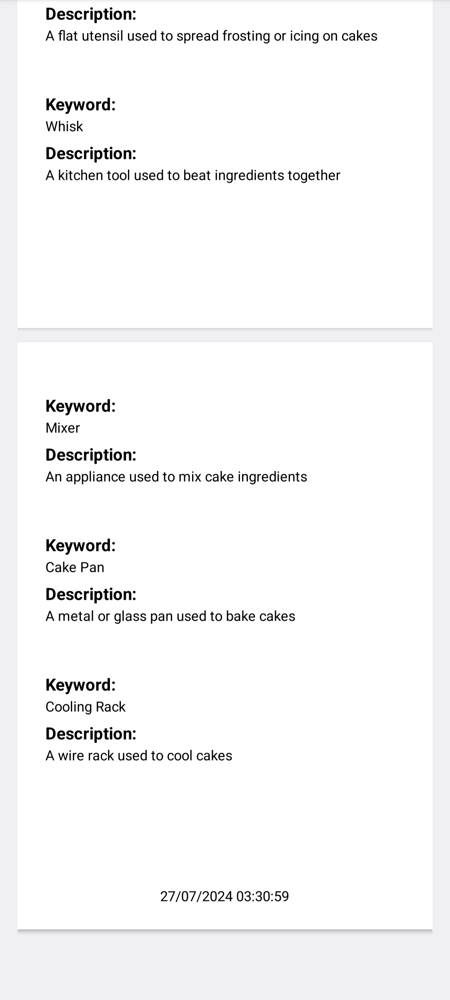

When you open the downloaded PDF of the Flashlet, you’ll see the title prominently displayed at the top center of the page, in bold and the largest font size. Below the title, the total number of flashcards included in the Flashlet will be indicated. Each flashcard will be formatted with the keyword listed first, followed by its description. There will be a space between each flashcard for clarity. At the bottom of the last page, you’ll find the date and time when the Flashlet was downloaded.