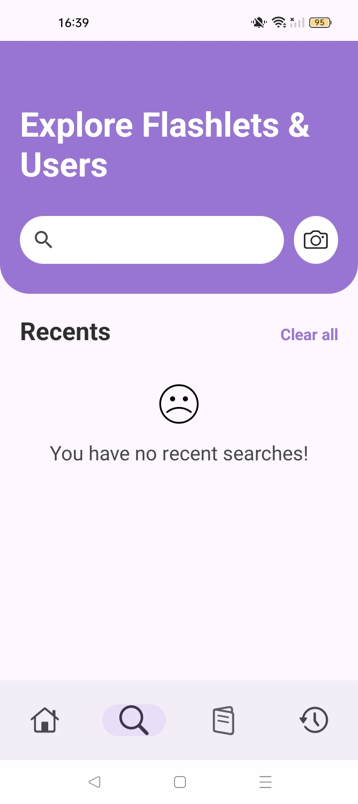
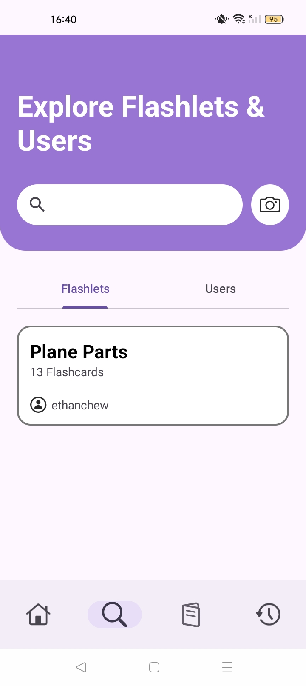
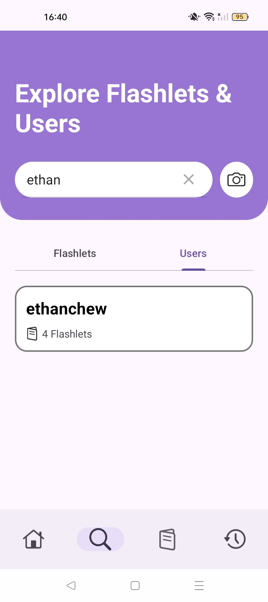
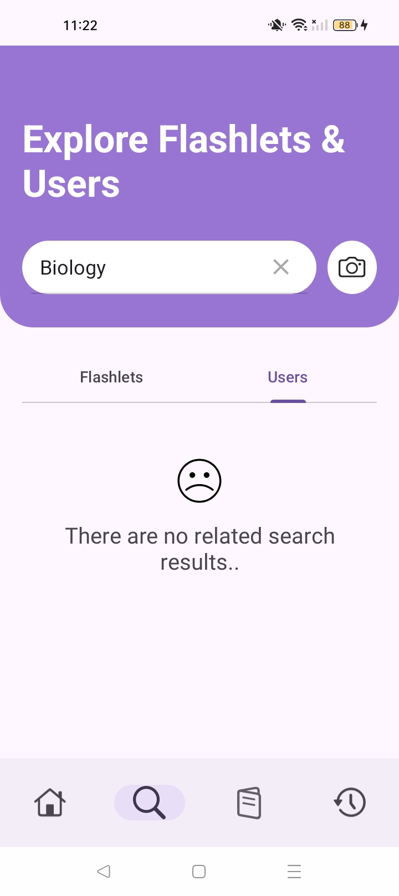
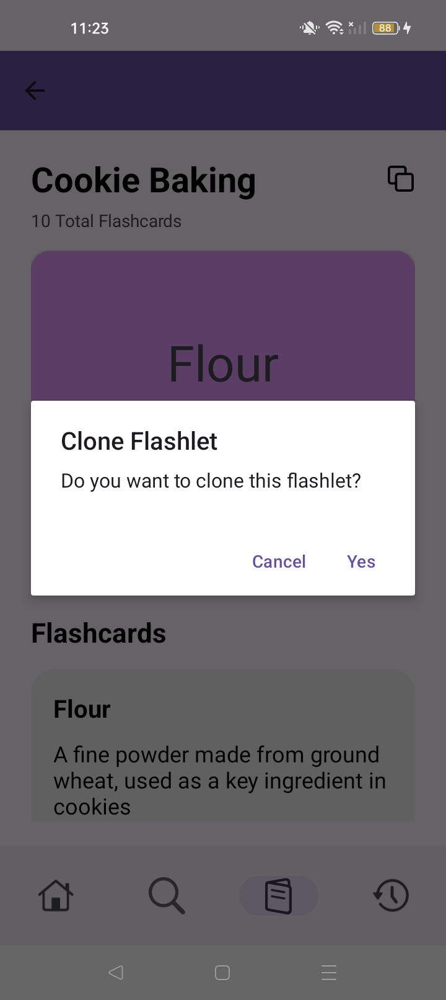
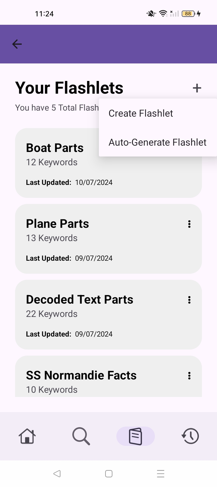
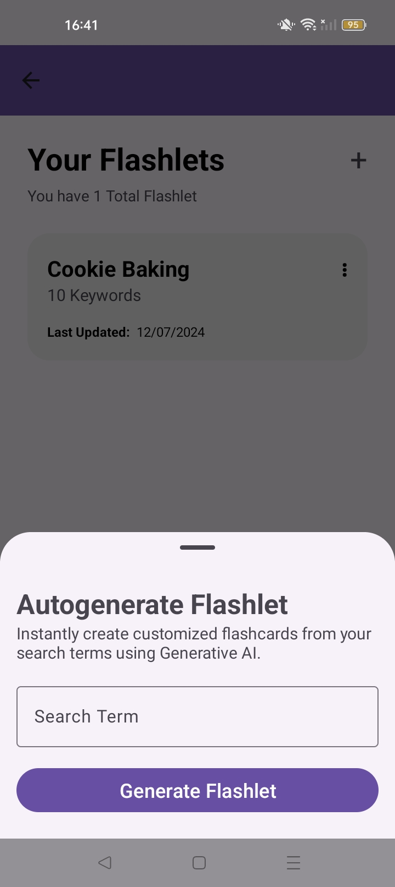

# Global Search and Auto-Generated Flashlets.
For [Ethan's](https://github.com/ethan-chew) Stage 2 feature, I developed a feature allowing users to search our database for Flashlets and clone them as needed. In addition, Auto-Generated Flashlets were made possible using Generative AI.

### Breakdown of Features Developed
These are a list of features developed under my Stage 2 Submission. A full description of each feature will be listed further below.
1. Global Search for Flashlets and Users
2. Flashlet Cloning
3. Optical Character Recognition
4. Auto-Generated Flashlets based on Keyword
5. Push Notifications

## Global Search for Flashlets and Users
The second tab in Quizzzy is now replaced with the Global Search feature. It allows users to search for all Public Flashlets and Users. Searching for a User will bring up that user's profile, displaying all public flashlets. All search results are stored locally in our SQLite database, the user's search history would be reset if they log out, or deletes the app.  

This feature fosters a collaborative learning environment within Quizzzy. If users need to study a particular topic, they are able to search for it on our platform and simply start studying.

  
  

When the Search Page is opened, the header displays a Search Bar and a Camera Icon beside it. The Camera Icon activates the OCR functionality, which will be explained later. A list view showcases the user's recent searches, with an option to clear all recent searches. Users can delete individual recent searches by tapping the 'X' beside the search term. If there are no recent searches, a message is shown.  

  
  

After entering a search term into the search bar, flashlet and user results are displayed. Users can switch between flashlet and user searches using the tab bar. Clicking on a specific flashlet or user navigates the user to the flashlet detail page or user profile page, respectively.  

If no related search results are found, a relevant message is shown to the user, ensuring a clear and informative user experience.

## Flashlet Cloning

Flashlet Cloning allows users to make a copy of any public flashlet, enabling them to edit and expand upon the original content. This feature ensures that users can personalize and enhance their study materials.  

Only flashlets made public by their owners can be cloned, ensuring user privacy. When the flashlet is cloned, the original owner of the flashlet would receive a notification.

## Optical Character Recognition (OCR)
OCR integration allows users to scan and convert text from real-life sources, such as textbooks, into a digital format. This is particularly useful for quickly searching for related flashlets or generating new flashlets based on unfamiliar terms encountered during study sessions.  

By leveraging OCR, users can enhance their learning experience through more convenient and efficient study methods.

## Auto-Generated Flashlets
Auto-Generated Flashlets allows users to create a flashlet by simply entering a topic. Quizzzy uses Generative AI to create Flashlets which are relating to the entered topic. Currently, the free-tier of Google’s Gemini 1.5 Flash is being used. Auto-Generated Flashlets saves users time and effort by allowing them to study effectively though related flashcards by simply inputting their desired topic.  

    
    

Users can create an Auto-Generated Flashlet from either the OCR Screen or the Flashlet List by tapping the '+' button. When this button is tapped, a Bottom Sheet Modal _(shown above)_ is displayed, prompting the user to enter their Flashlet Topic Term. Tapping the 'Generate Flashlet' button initiates the flashlet creation process. Once the flashlet is created, the user is directed to the Flashlet Detail page.

## Push Notifications
When another User clones one’s public flashlet, a notification will be sent to the owner. This helps keep the owner informed about the usage of their Flashlet.  

To make this feature work, the Firebase Cloud Messaging service was used. All notification requests are sent to a custom backend which handles the request. Push Notifications for Cloned Flashlets will work in real-time.  

_**Potential Limitation:** The backend was created in Node.js and hosted on Render. As the backend is hosted for free, Render will spin it down after 15 minutes of no inbound traffic. The backend is then automatically brought back up when it receives a new request. However, spinning up the service takes some time, which will cause a noticeable delay._