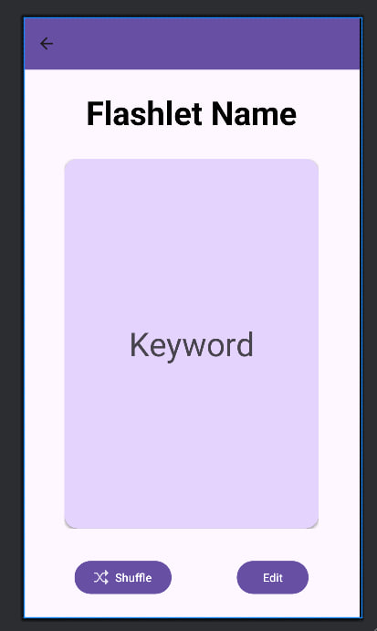
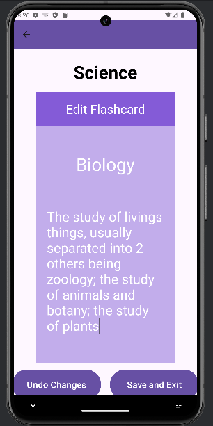

#Statistics & Flashcard UI
For [Shin's](//https://github.com/Shin-ThantAung) Stage 2 feature, I developed visualization for statistics and improved UI and UX of flashcards.

###Breakdown of Features Developed
These are a list of features developed under my Stage 2 Submission. A full description of each feature will be listed further below.
1. Bar Graph for statistics
2. Swiping gesture and clicking to swipe and flip flashcards
3. Improved UI for flashcards

##Bar Graph for statistics
This feature allows user to see the amount of time spend on flashcards in a week

  

Shows weekly usage of flashcards

##Swiping gesture and clicking to swipe and flip flashcards
This feature allows user to swipe the flashcard and click the flashcard to flip it.

  

If the user swipe on the flashcard, the new flashcard would be displayed.
If the user click on the flashcard, the flashcard would flip showing the back of the card.

##Improved UI for flashcards
The overall UI for flashcard is improved.

  

Buttons to flip and swipe flashcard has been removed and the UI is optimized.

  

Allow the input to expand and scrollable if user put in long texts.