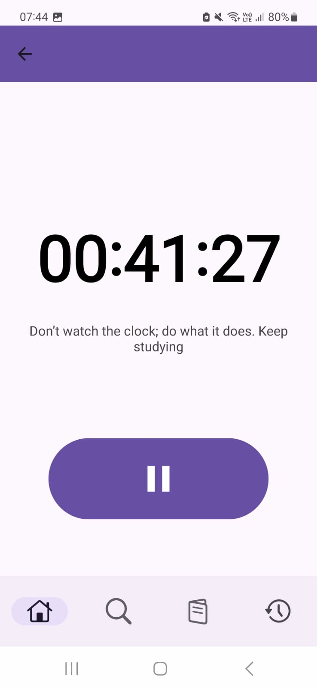
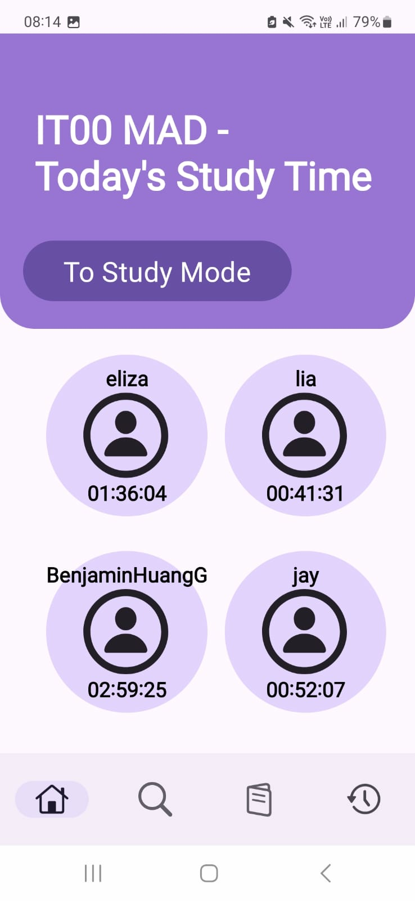
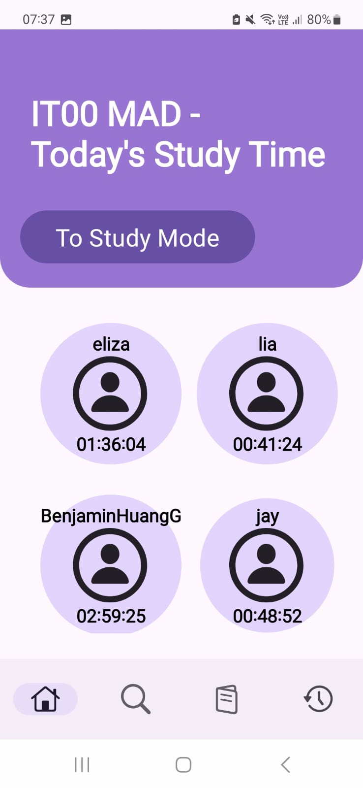

# Study Mode - Darius Koh Kai Keat (S10255626K)
For [Darius'](https://github.com/dariusKoh) Stage 2 feature, I added a new feature to the application: Study Mode. This allows the user to track their study time, enabling productivity.

### Breakdown of Features Developed
These are a list of features developed under my Stage 2 Submission. A full description of each feature will be listed further below.
1. Study Mode
2. Real-Time Study Duration within Classes 
3. Built in Gyroscope 
4. Screen and Activity State Tracking


## Study Mode
Study Mode allows the user to track their current study time per day, which can give them a visual representation of the total amount of work that they had put into their studies, giving them motivation and affirmation for the amount of work that they have put in.

<div style="display: flex; gap: 10px;">
   
</div>

## Real-Time Study Duration within Classes
A Real-Time study time tracker was added to the classes functionality of the app. This allows students to look at everyone's progress throughout the day, which can encourage students to study. This was completed using Firebase's Realtime Database, as such, updates will be accurate.

The circle behind each student will pulse if they are currently using Study Mode.

<div style="display: flex; gap: 10px;">
   
   
</div>

In the 2nd image on the right, the purple background under "Jay" is smaller due to it pulsing.

## Built in Gyroscope
A gyroscope was added into the Study Duration Activity, which allows the student to place their device face down on their table to dim their screen to its maximum dimness. This feature was added so that the user would not have to unlock their phone every time they need to access their applications when studying, for example when requiring a calculator.

This also indirectly allows the user to concentrate better, as they would not be able to see their device screen and get distracted by it.

The following code shows how the Z-axis is calculated to determine if the screen is face-down

The formula is not 100% accurate for all phones, but was the most effective when tested on multiple devices
```java
// Gyroscope tracker
@Override
public void onSensorChanged(SensorEvent event) {
    if (event.sensor.getType() == Sensor.TYPE_ACCELEROMETER) {
        // Acceleration in the Z-axis
        float z = event.values[2];

        // If screen is face down, dim the screen
        // When the screen is no longer face down (picked up), reset brightness
        if (z < -9.0) {
            dimScreen();
        } else {
            restoreScreenBrightness();
        }
    }
}
```
_**Note:** Images were unable to be captured due to my camera being unable to pick up the differences in the dimness. A test for this would be to either lie down with the device facing down, or simply flip the phone and check the screen._

## Screen and Activity State Tracking
To facilitate more accurate tracking of study time, I enabled the tracking of the screen and activity state. This allows the user to be able to turn off their screen, and the study timer would still continue to track their study time. Additionally, changing activities to view Flashcards would not affect their study time, as for any using any other activites on the app. However, exiting the app via the home screen or multi-window screen will cause the timer to pause.

By calling AppLifeCycleObserver, which is an implementation of DefaultLifecycleObserver, I was able to obtain the state of the application. This let me track whenever the app enters the background, for example, when exiting to the home page or turning the screen off.

When used in conjunction with the extended Application class, this allowed me to track it globally across the app, instead of only within an activity.
```java
public class AppLifecycleObserver implements DefaultLifecycleObserver {
    @Override
    public void onStart(LifecycleOwner owner) {
        appInForeground = true;
        ...
    }

    @Override
    public void onStop(LifecycleOwner owner) {
        appInForeground = false;
        ...
    }
}

public class QuizzzyApplication extends Application { 
    @Override
    public void onCreate() {
        super.onCreate();

        // Uses Application class to globally monitor lifecycle of all activites
        // Using ProcessLifecycleOwner to provide lifecycle and DefaultLifecycleObserver to monitor lifecycle events
        AppLifecycleObserver appLifecycleObserver = new AppLifecycleObserver();
        ProcessLifecycleOwner.get().getLifecycle().addObserver(appLifecycleObserver);
    }
}
```

By using the PowerManager functionality, I was able to get the screen state and reliably check if the screen was turned off.
```java
public boolean isScreenOn(Context context) {
    PowerManager pm = (PowerManager) context.getSystemService(Context.POWER_SERVICE);
    screenOn = pm.isInteractive();
    return screenOn;
}
```
